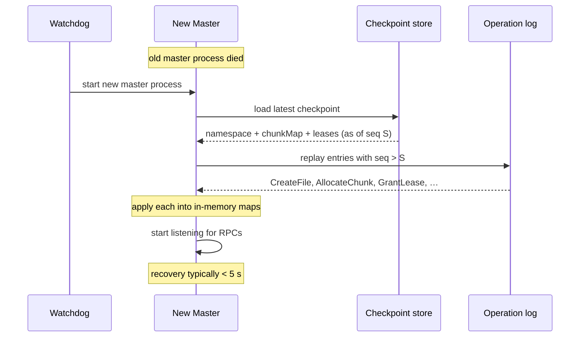

# Flow: Master Crash Recovery

How a crashed master rebuilds its entire in-memory state from disk. This is the payoff of the op-log + checkpoint design.

## Sequence

## Steps

1. **Restart** — an external watchdog (systemd, K8s, or manual) starts a fresh master process. There is no master election in this implementation (out of scope).
2. **Load checkpoint** — the new master opens the latest checkpoint file and deserializes it into RAM (`Checkpoint.load`): the full namespace, chunk map, and active leases as of sequence `S`.
3. **Replay tail** — it opens the operation log and replays every entry with sequence `> S` (`OperationLog.replay`), applying each into the in-memory maps. Because mutations were `fsync`'d before being acked (ADR 0008), every acked mutation is present.
4. **Resume** — the master starts listening. Recovery is dominated by checkpoint load (single-digit seconds for ~100 MB) plus a short log replay.

## What clients see

During recovery, clients get connection refusals and retry. Their cached metadata is still valid for the lease window (60 s), so cached **reads continue to succeed against chunkservers** without touching the master — the outage is mostly invisible to readers.

## Failure modes

| Failure | What happens |
|---|---|
| Op log unreadable (disk corruption) | new master bootstraps from the checkpoint only; mutations since the checkpoint are lost. Production mitigates by replicating the op log to remote machines (mocked here as local mirror dirs) |
| Crash mid-checkpoint | the checkpoint is written to a `.tmp` and atomically renamed, so a half-written checkpoint is never loaded |
| Crash during replay | replay is idempotent; restart and replay again |

## Related

- Modules: [`gfs-master`](../modules/gfs-master.md), [`gfs-oplog`](../modules/gfs-oplog.md)
- ADR: [0008 op-log fsync before ack](../decisions/0008-oplog-fsync-before-ack.md)
