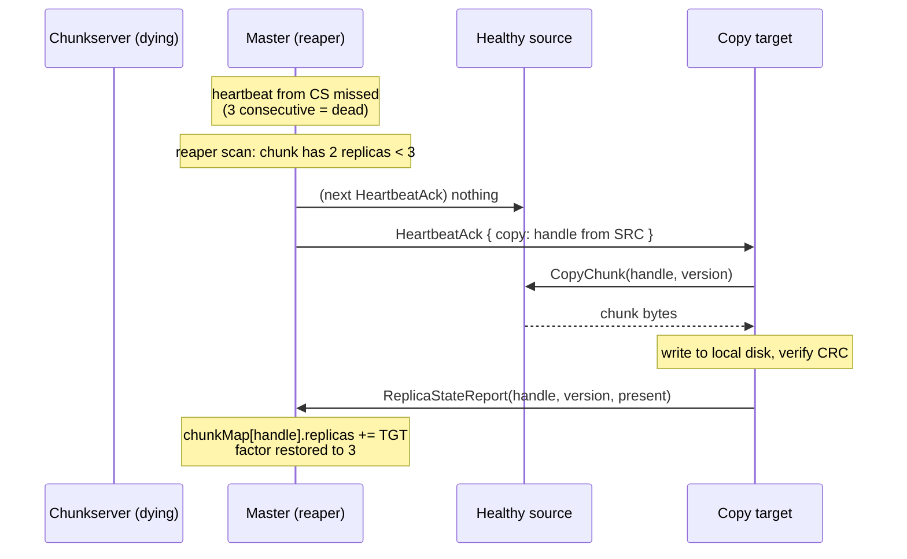

# Flow: Re-Replication

How the master restores the replication factor after a chunkserver dies. This is the mechanism that makes daily disk failures invisible.

## Sequence

## Steps

1. **Detect death** — the master's per-chunkserver missed-heartbeat counter exceeds the threshold (3 misses ≈ 15 s). All replicas on that server are marked stale.
2. **Reaper scan** — every 30 s the reaper walks `chunkMap` for chunks below the replication factor. Priority: chunks with **1** remaining replica (danger of loss) before chunks with 2.
3. **Assign copy** — the master picks a healthy source and a target chunkserver not already holding the chunk, logs the intent (`SetChunkReplicas`), and piggybacks a copy instruction on the target's next `HeartbeatAck`.
4. **Copy** — the target pulls the chunk from the source over the wire (`CopyChunk`), writes it locally, verifies CRC.
5. **Confirm** — the target sends a `ReplicaStateReport`; the master adds it to the replica set; the factor is restored.

## Failure modes

| Failure | What happens |
|---|---|
| Source dies mid-copy | target's copy fails; reaper picks a different source next scan |
| Target disk full | reaper skips it (disk-free reported via heartbeat); picks another target |
| Partitioned server returns | treated as fresh — it claims no replicas; its on-disk chunks become orphans the master tells it to delete |
| Many chunks under-replicated at once | priority queue handles 1-replica chunks first; balancing-driven moves are out of scope |

## Related

- Modules: [`gfs-master`](../modules/gfs-master.md), [`gfs-chunkserver`](../modules/gfs-chunkserver.md)
- ADR: [0001 in-memory master](../decisions/0001-in-memory-master.md)
